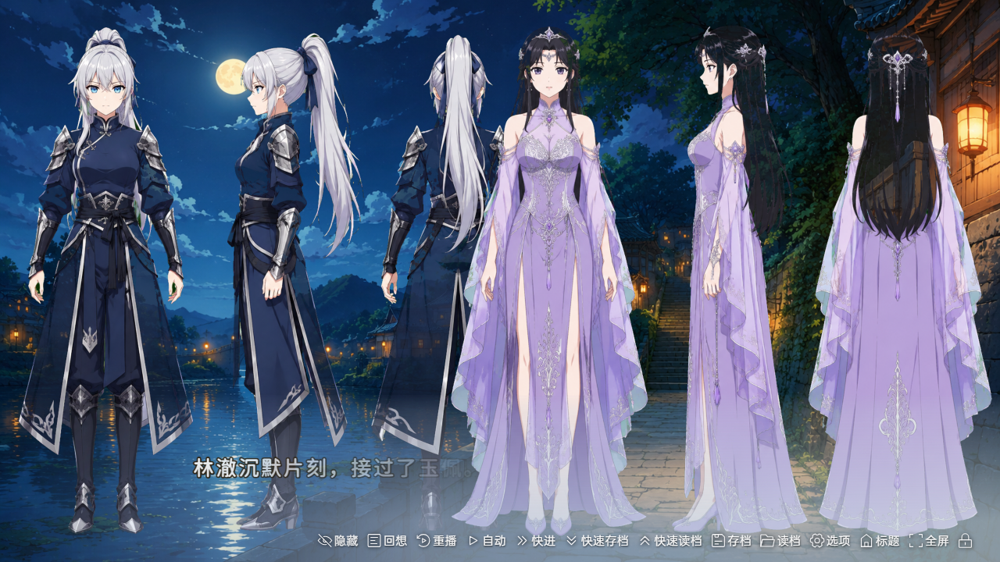
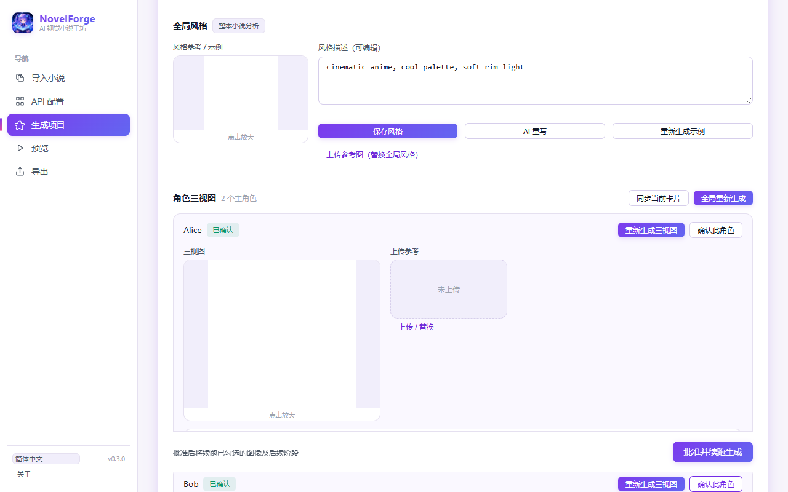

<div align="center">


# NovelForge

**ワンクリックで小説がビジュアルノベルに。**

文字だけでは読む気が起きない、絵があれば没入できる。ワンクリックで小説をプレイ可能なビジュアルノベルに変換——立ち絵・表情・CG・ボイス・BGM・分岐をすべて自動生成。プレビューして、パッケージ化（exe / APK / Web）、配布まで完了します。

<p>
  <a href="https://github.com/carloncc/NovelForge/blob/main/LICENSE"></a>
  <a href="https://github.com/carloncc/NovelForge/releases"></a>
  <a href="https://github.com/carloncc/NovelForge/stargazers"></a>
  <a href="https://github.com/carloncc/NovelForge/issues"></a>
  <a href="https://www.forgepeaknow.com/?utm_source=github&utm_medium=readme&utm_content=ja-jp"></a>
</p>
Tauri 2 + Vue 3 + WebGAL · 軽量・高速 · API は完全カスタマイズ

[English](README.md) · [简体中文](README.zh-CN.md) · **日本語** · [한국어](README.ko-KR.md) · [公式サイト](https://www.forgepeaknow.com/?utm_source=github&utm_medium=readme&utm_content=ja-jp) · [変更履歴](https://github.com/carloncc/NovelForge/releases)

</div>

---

<details>
<summary><kbd>📑 目次</kbd></summary>

- [なぜ NovelForge なのか？](#なぜ-novelforge-なのか)
- [ワンクリックで完了](#ワンクリックで完了)
- [クイックスタート](#クイックスタート)
- [NovelForge を使うべきでない場合](#novelforge-を使うべきでない場合)
- [特徴](#特徴)
- [スクリーンショット](#スクリーンショット)
- [API 設定例](#api-設定例)
- [ビジュアルバイブル（画像生成ゲート）](#ビジュアルバイブル画像生成ゲート)
- [Web モード（ブラウザで直接実行、ビルド不要）](#web-モードブラウザで直接実行ビルド不要)
- [ユニバーサルアダプター（画像 / TTS）](#ユニバーサルアダプター画像--tts)
- [出力構成（標準 WebGAL プロジェクト）](#出力構成標準-webgal-プロジェクト)
- [開発とテスト](#開発とテスト)
- [アーキテクチャ](#アーキテクチャ)
- [コミュニティ](#コミュニティ)
- [コントリビュート](#コントリビュート)
- [免責事項](#免責事項)
- [クレジットとライセンス](#クレジットとライセンス)
- [Roadmap](#roadmap)

</details>

## なぜ NovelForge なのか？

| | 理由 |
|---|---|
| 🪄 **ワンクリック、手作業ゼロ** | ビジュアルノベルを手作りするには、立ち絵の作画、演出の構築、ボイスの収録が必要です。NovelForge はこれらをすべて自動化します：小説をインポート → 生成を押す → 遊べて配布できる完成品が手に入る |
| 🎬 **読むのではなく観る** | 物語は文字でも伝わりますが、表情を持つキャラ、シーン CG、ボイス、BGM は、文字だけでは得られない没入感を提供します——しかもすべて自動生成で、手作業の画面制作は不要です |
| 🔥 **誰もアダプトしない小説のために** | 人気作品はアダプト・翻訳されますが、マイナーな作品はそのどちらも得られにくいものです。NovelForge はまさにこのギャップを対象にしています：ニッチな物語を共有可能なビジュアルノベルに。多言語翻訳（中/英/日/韓）も内蔵 |

## ワンクリックで完了

```
小説.txt ─▶ ワンクリック ─▶ 立ち絵 · 表情 · CG · 背景 ─▶ ボイス · BGM ─▶ プレイ可能なビジュアルノベル
   AI パイプライン：分割 → 翻訳 → 抽出 → シナリオ → 画像 → ボイス → 組立      └─▶ プレビュー / exe / APK / Web zip
```

> API キーはご自身で用意してください（キーがない場合：サンプル小説内蔵のデモモードで全工程が動作します）。画像を有効にする場合、一括生成の前に一度スタイル確認（ビジュアルバイブル）が必要です。

## クイックスタート

### アプリのダウンロード

<p align="center">
  <a href="https://github.com/carloncc/NovelForge/releases/latest"></a>
  <a href="https://github.com/carloncc/NovelForge/releases/latest"></a>
  <a href="https://github.com/carloncc/NovelForge/releases/latest"></a>
</p>

| プラットフォーム | 入手方法 |
|---|---|
| Windows / macOS / Linux | [最新リリース](https://github.com/carloncc/NovelForge/releases)（Rust/Node のインストール不要） |
| 任意のプラットフォーム（ブラウザ） | Web デモ版——インストール不要でブラウザで直接実行（下記参照） |
| 公式サイト | [https://www.forgepeaknow.com/?utm_source=github&utm_medium=readme&utm_content=ja-jp](https://www.forgepeaknow.com/?utm_source=github&utm_medium=readme&utm_content=ja-jp) —— Web デモと最新情報 |

> API キーがなくても体験可能：自動でデモモード（サンプル小説内蔵）に入り、全工程が動作します——まず試してから設定。

### Web デモ版を実行（インストール不要・ビルド不要）

```bash
git clone git@github.com:carloncc/NovelForge.git
cd NovelForge
pnpm install
pnpm prepare:template   # WebGAL エンジンテンプレート取得（初回のみ、約 75MB、自動トリミング）
npm run dev             # ブラウザで http://localhost:5173 を開く
```

### デスクトップ版を開発実行

```bash
pnpm tauri dev
```

動作環境：Node.js 18+ · pnpm · Rust（https://rustup.rs）· Windows / macOS / Linux。

### ビルド・リリース

```bash
pnpm tauri build
```
成果物は `src-tauri/target/release/bundle/`（Windows exe / macOS dmg / Linux AppImage）。

### 使い方

1. **小説をインポート**：txt を選択（GBK/UTF-8 自動判定）、章を自動分割。複数ファイルと LLM による高度な章分割にも対応。カスタム素材のインポートも可能
2. **API を設定**：テキスト LLM の base_url + key + model を入力（DeepSeek が最安、約 ¥1-2/100万トークン）。画像/TTS/ビジョンは後から追加可能（画像生成前までに画像チャンネル設定が必要）
3. **生成**：機能トグル（画像/表情差分/ボイス/動画スロット/BGM/紹介カード）→ 開始 → テキスト工程が先行。画像有効時は先に**ビジュアルバイブル承認**（スタイルソース選択 → 三面図生成/確認 → 承認）→ 承認後に画像/ボイス/組立を実行 → 進捗ログ + 費用統計。ステージ単位の再実行、AI 章分割へのフィードバックも可能
4. **プレビュー**：組み込み WebGAL エンジンで即プレイ
5. **エクスポート**：Web zip は直接デプロイ。exe/APK は生成される「导出说明.txt」の手順に従う

## NovelForge を使うべきでない場合

- 特定の絵師によるピクセルパーフェクトなアートが必要な場合：生成される立ち絵は AI アート——個人プロジェクトには最適ですが、商業向けの美術ディレクションには不向きです。
- 純粋なテキストリーダー（画面なし）だけが欲しい場合：これはビジュアルノベルパイプラインであり、電子書籍リーダーではありません。
- AI コストが一切許容できない場合：生成は自分のキーでベンダー API を呼びます（デモモードは無料ですがサンプルプロジェクトのみ）。

## 特徴

| | 説明 |
|---|---|
| 📖 **オールインワンパイプライン** | 章分割 → 多言語翻訳 → カード抽出 → シナリオ（自動 CG 演出・アイテム特写・初登場紹介カード・動画スロット）→ 画像 → ボイス → 標準 WebGAL 組立 |
| 🎨 **背景透過立ち絵** | 自動切り抜き（AI セグメンテーション、初回にモデル自動ダウンロード・キャッシュ。オフライン時は改良版クロマキーに自動フォールバック：連結 flood-fill + 緑縁除去 + エッジフェザリング） |
| 🎨 **画風の一貫性** | プロジェクト全体の「スタイルアンカー画像」+ 固定シード + 共通ネガティブプロンプト + チェーン img2img（三面図 → 立ち絵 → 表情/アクション）。マルチモーダル自己チェックで参照画像との一致を確認 |
| 📖 **ビジュアルバイブル・ゲート** | 画像の一括生成前に「ビジュアルバイブル」承認が必須：スタイルソースを選択（アップロードした参照画像をビジョンで分析 / LLM が小説全体を分析してスタイル見本を生成）+ 全主人公の三面図（正面/側面/背面）。特定キャラの三面図のみ再生成可能。入力が変わると承認は自動的に無効化 |
| 😊 **表情差分** | キャラごとに 5 表情（通常絵を参照に一貫性を維持）、セリフの感情に応じて自動切替 |
| 🏃 **アクション立ち絵** | 三面図から img2img でアクション立ち絵（抜剣・手振り・腕組みなど）を生成、見た目の一貫性を保持 |
| 🔀 **分岐選択** | LLM が決断ポイントを検出し 2〜3 択を生成、各分岐は本線に合流（WebGAL choose/label/jumpLabel） |
| 🎬 **章タイトルカード** | 各章冒頭に全画面タイトル演出 |
| ✨ **演出強化** | 名シーンは全面 CG、重要アイテムは特写演出、初登場キャラには紹介カード |
| 🎬 **動画スロット** | AI が名シーン位置をマークし動画プロンプトを作成。指定ファイル名で動画（即夢/可灵 など）を配置すると自動で有効化（API 費用ゼロ） |
| 🎙️ **ボイス + 声色制御** | セリフ単位で TTS、声色ライブラリ設定可能、AI がキャラに最適な声色を選択、失敗時は自動でフォールバック |
| 🎵 **BGM** | 音楽ファイルを雰囲気キーワードで自動マッチング。シーン/章の切替時にフェードアウト停止、BGM 鑑賞も解放 |
| 🌐 **UI 5 言語** | アプリの表示言語はシステム言語に自動追従（簡中/繁中/英/日/韓）、いつでも切替可能——小説コンテンツとゲームの翻訳は「目標言語」で別途制御。 |
| 🔌 **API 完全カスタム** | LLM / ビジョン / 画像 / TTS の 4 チャンネルそれぞれに base_url + api_key + model（OpenAI 互換プロトコル）、複数プリセット + テストボタン。画像チャンネルは能力（参照画像数/img2img/シード）をモデル別に設定・自動検出 |
| 🗂️ **素材優先** | キャラ/アイテム/背景画像をインポートし手動マッピング可能。パイプラインは既存素材を優先し、不足分のみ AI 生成 |
| ♻️ **コスト管理** | 全工程ディスクキャッシュ・再開・章単位リラン・中止ボタン・トークン/費用統計・予算上限（超過で自動中止）・失敗タスク一覧と再試行・ログ保存 |
| 💾 **状態の永続化** | 小説/素材/オプション/結果を自動保存。AI 章分割スナップショットで再起動しても章を失わない。最近のプロジェクト履歴でワンクリック切替 |
| 📦 **3 形式エクスポート** | Web zip（キャッシュ自動除外）/ エクスポート前チェック（Lint）/ エクスポート設定（タイトル・game_key・UI 言語）/ PC exe（WebGAL Terre）/ Android APK（公式ツール） |
| 🔒 **セキュリティ** | LLM 出力インジェクション対策、CSP、依存監査で既知 CVE ゼロ |

## スクリーンショット

## スクリーンショット

### 生成されたゲーム（サンプル小説、WebGAL エンジンで実際に動作中）

| タイトル画面 | ストーリーシーン | 名場面 CG |
|---|---|---|
|  |  |  |

### NovelForge アプリ

| 小説インポート | API 設定 | 生成 |
|---|---|---|
|  |  |  |

| エクスポート | ビジュアルバイブル |
|---|---|
|  |  |

## API 設定例

| サービス | チャンネル | Base URL | モデル例 |
|---|---|---|---|
| DeepSeek | LLM | `https://api.deepseek.com` | `deepseek-chat` |
| SiliconFlow | ビジョン | `https://api.siliconflow.cn/v1` | `zai-org/GLM-4.6V` |
| SiliconFlow | 画像（参照画像） | `https://api.siliconflow.cn/v1` | `Qwen/Qwen-Image-Edit-2509` |
| SiliconFlow | 画像 | `https://api.siliconflow.cn/v1` | `black-forest-labs/FLUX.1-schnell` |
| SiliconFlow | TTS | `https://api.siliconflow.cn/v1` | `FunAudioLLM/CosyVoice2-0.5B` |
| OpenAI | LLM | `https://api.openai.com/v1` | `gpt-4o-mini` |
| Kimi | LLM | `https://api.moonshot.cn/v1` | `moonshot-v1-8k` |
| Ollama（ローカル） | LLM | `http://localhost:11434/v1` | `qwen2.5:7b` |

**ビジョンチャンネル**：「画像を読む」すべての操作（スタイル参照画像の分析、キャラ参照の照合、画像セルフチェック）を担当し、テキスト LLM とは独立。新規設定はビジョンに SiliconFlow `zai-org/GLM-4.6V`、画像に `Qwen/Qwen-Image-Edit-2509`（参照画像最大 3 枚 / img2img）をデフォルト設定。旧 3 チャンネル構成は初回ロード時に自動移行。

## ビジュアルバイブル（画像生成ゲート）

画像生成を有効にすると、一括生成の前に**ビジュアルバイブル**の承認が必須になります（テキスト抽出/シナリオは影響なし）：

- **スタイルソース（二択）**：参照画像をアップロード（ビジョンチャンネルが分析し、グローバルなスタイル参照として使用）、または LLM が小説全体を分析しキャラなしのスタイル見本を生成。
- **キャラ三面図**：各主人公の正面/側面/背面を生成。個別に「三面図を再生成」可能、キャラ参照画像もアップロード可。影響はそのキャラのみ。
- **承認と続行**：キャラごとに確認 → ビジュアルバイブルを承認 → 画像/ボイス/組立が自動再開。小説・キャラ・スタイルに変更があると承認は無効化。
- **サイレントフォールバックなし**：参照画像非対応モデルは `REFERENCE_UNSUPPORTED`、参照ファイル欠落は `REFERENCE_MISSING` を明示。ビジョンチャンネル未設定時も明確な設定案内。

**保存場所**：すべてプロジェクト出力ディレクトリ `.novel2vn/visual-bible/` 配下（マニフェスト `visual-bible.json` は相対パス/プロンプト/承認状態のみ保存、base64 は含まず。画像は `style-reference.*`、`style-sample.png`、`threeview_<キャラID>.png` など）。参照ファイル欠落の場合はディレクトリが移動・削除された可能性があります：元のパスに戻すか、ビジュアルバイブル画面で再アップロード/再生成してください。

## Web モード（ブラウザで直接実行、ビルド不要）

```bash
npm run dev          # または pnpm dev、ブラウザで http://localhost:5173 を開く
```

Web 版はデスクトップ版と同じ機能をブラウザ内の同等実装で提供：

| デスクトップ（Tauri） | Web モード |
|---|---|
| ローカルファイルシステム | IndexedDB 仮想ファイルシステム（ブラウザに永続化） |
| Rust HTTP クライアント（CORS 制限なし） | dev サーバープロキシ中継（`/__novelforge/proxy`） |
| 組み込みプレビューサーバー | フロントが zip 化 → dev サーバーが展開して配信（同一オリジン iframe） |
| Rust rembg 切り抜き | canvas 連結 flood-fill クロマキー（白/黒背景の自動除去） |
| バンドル済み WebGAL テンプレート | `src-tauri/templates/webgal` を IndexedDB へオンデマンド同期 |
| ネイティブファイルダイアログ | ブラウザの `<input type="file">` |
| zip をディスクへ保存 | エクスポート zip を自動ダウンロード |

> 本番：`npm run build` + `npm run preview`（preview サーバーも同じプロキシ/プレビュー中間層を搭載、リバースプロキシ可能）。
> バックエンドのない静的ホスティングではブラウザ直結にフォールバック（ベンダーが CORS 対応している必要あり）。

## ユニバーサルアダプター（画像 / TTS）

各ベンダーの画像/音声プロトコルは大きく異なります（OpenAI 互換 / MiniMax 独自 / Alibaba タスクポーリング）。
NovelForge は**設定駆動のユニバーサルアダプターエンジン**（`sync`/`async` モード + フィールドマッピングテンプレート）を内蔵。設定画面の「ベンダーテンプレート」からワンクリック選択：

| ベンダー | 画像 | TTS |
|---|---|---|
| OpenAI 互換（Zhipu CogView / OpenAI） | ✅ openai-image | ✅ openai-tts |
| SiliconFlow（FLUX、推奨） | ✅ siliconflow-image（シード / ネガティブ / img2img フル対応） | ✅ openai-tts |
| MiniMax（image-01 / speech-2.8） | ✅ minimax-image | ✅ minimax-tts（HEX 自動デコード） |
| Alibaba DashScope（wanx-v1 / CosyVoice） | ✅ dashscope-image（タスクポーリング、シード/ネガティブ対応） | ✅ dashscope-tts |

ほかにも **Google Gemini**（`/v1beta/models/{model}:generateContent`、inlineData 自動抽出）と
**Stability AI**（multipart/form-data + 生バイナリ応答）を内蔵。エンジンはベンダー別エラーボディ（`base_resp` / `error.message` / `output.message` など）を自動解析して読みやすいメッセージに変換します。

新しいベンダーは「詳細 → カスタムアダプターテンプレート」に JSON を貼るだけでコード変更なしで接続可能。
参照画像能力（0〜3 枚、img2img、シード）は画像チャンネルでモデル別に設定・自動検出。能力不足や参照ファイル欠落時は明示的にエラーになり、静かに文生図へフォールバックすることはありません。

## 出力構成（標準 WebGAL プロジェクト）

```
出力ディレクトリ/
├─ index.html, assets/          # WebGAL エンジン（同梱）
├─ 导出说明.txt                 # exe/APK/Web zip の導出手順
├─ video_plan.txt               # AI が作成した動画スロット一覧（プロンプト）
└─ game/
   ├─ config.txt                # ゲーム設定
   ├─ scene/start.txt, ch*.txt  # シナリオ（テキストで直接編集可）
   ├─ background/  figure/  vocal/  bgm/  video/
   └─ .novel2vn/                # キャッシュと中間生成物（削除可）
      └─ visual-bible/          # ビジュアルバイブル：マニフェスト + スタイル参照 + 三面図
```

## 開発とテスト

```bash
# ユニット & E2E テスト（Node）
npx tsx tests/unit-render.ts      # レンダリング注入境界
npx tsx tests/unit-chapters.ts    # 章分割境界
npx tsx tests/unit-cache.ts       # キャッシュ/再開の一貫性
npx tsx tests/unit-tasks.ts       # 画像タスク構築
npx tsx tests/unit-material.ts    # 素材優先マッチング
npx tsx tests/unit-features.ts    # 紹介カード/表情/BGM/動画スロット
npx tsx tests/unit-persist.ts     # 状態永続化
npx tsx tests/unit-retry.ts       # API リトライ機構
npx tsx tests/unit-dedupe.ts      # シーン id 重複排除
npx tsx tests/unit-universal.ts   # ユニバーサルアダプターエンジン（全ベンダーテンプレート）
npx tsx tests/unit-vfs.ts         # IndexedDB 仮想ファイルシステム
npx tsx tests/e2e-demo.ts         # E2E パイプライン（サンプル小説）

# 実機エンジン検証（ヘッドレスブラウザで生成ゲームをロード）
npx tsx tests/engine-check.ts <プロジェクトディレクトリ>

# Rust 側テスト（クロマキー切り抜き）
cd src-tauri && cargo test
```

## アーキテクチャ

```
┌────────────────────────────────────────────┐
│  NovelForge（Tauri 2 + Vue 3 + TypeScript） │
│  ├─ pages: インポート / 設定 / 生成 /       │
│  │          プレビュー / エクスポート        │
│  ├─ core:  split → translate → extract →   │
│  │          script → images → voice →      │
│  │          render → project               │
│  ├─ api:   OpenAI 互換アダプター            │
│  │          （LLM / ビジョン / 画像 / TTS）  │
│  └─ Rust:  ファイル IO / HTTP 中継 /        │
│            プレビューサーバー / クロマキー   │
│            切り抜き / 設定保存              │
└───────────────┬────────────────────────────┘
                ▼ 標準 WebGAL プロジェクト
┌────────────────────────────────────────────┐
│  WebGAL エンジン（MPL-2.0、改変なし）        │
│  プレビュー（内蔵）/ exe（Terre）/           │
│  APK（公式ツール）                          │
└────────────────────────────────────────────┘
```

## コミュニティ

- [公式サイト](https://www.forgepeaknow.com/?utm_source=github&utm_medium=readme&utm_content=ja-jp) —— Web デモと最新情報
- [Issues & 機能リクエスト](https://github.com/carloncc/NovelForge/issues) —— バグ報告、アイデア、フィードバック
- [Discussions](https://github.com/carloncc/NovelForge/discussions) —— 作ったゲームを見せる、質問する
- [WebGAL](https://github.com/OpenWebGAL/WebGAL) —— エンジン本体。WebGAL のコミュニティはシーンスクリプトに詳しい

[](https://star-history.com/#carloncc/NovelForge&Date)

作ったビジュアルノベルを公開しましょう——それがこのツールの存在意義です。

## コントリビュート

バグ報告、機能提案、翻訳、コードなど、あらゆる形の貢献を歓迎します。

- バグ報告・機能リクエスト：[Issues](https://github.com/carloncc/NovelForge/issues)
- ディスカッション：[Discussions](https://github.com/carloncc/NovelForge/discussions)
- コード変更時は PR 前にテストを実行してください（[開発とテスト](#開発とテスト) 参照）

**主要メンテナー：** [@carloncc](https://github.com/carloncc)

## 免責事項

本ソフトウェアは「現状のまま」提供され、いかなる保証もありません。NovelForge を使用することで、あなたは以下を理解し同意したものとみなされます：

- **生成コンテンツに対する責任はすべてあなたにあります**：本ツールが生成する AI コンテンツ（画像・ボイス・シナリオ）と、その使用・公開・配布方法について、あなたがすべての責任を負います。作者はモデル出力を制御できず、それに対する責任も負いません。
- **権利のあるコンテンツのみ使用してください**：所有している、または翻案の権限がある小説のみを読み込んでください。生成結果は、設定した AI プロバイダーの利用規約に従う場合があります。
- **第三者 API の費用と規約は自己責任です**：NovelForge は、あなたが設定したキーでプロバイダーを呼び出します。利用量と請求はご自身で監視してください。
- **違法・権利侵害コンテンツを生成しないでください**：著作権で保護されたキャラクター、実在人物の肖像、憎悪や有害な内容を含みます。適用される法令とプラットフォームポリシーの遵守はあなたの責任です。
- **必要な帰属表示を維持してください**：NovelForge で公開する作品には WebGAL の著作権表示を残す必要があります（[LICENSE](./LICENSE) 参照）。

## クレジットとライセンス

- [WebGAL](https://github.com/OpenWebGAL/WebGAL) —— ビジュアルノベルエンジン（MPL-2.0）、[THIRD_PARTY_NOTICE](./THIRD_PARTY_NOTICE) 参照
- NovelForge 本体は [MIT](./LICENSE) ライセンス
- 公開作品には WebGAL の著作権表示を残す必要があります。ゲームコンテンツの著作権は作者に帰属します

## Roadmap

- [x] 画風一貫性：スタイルアンカー + 固定シード + ネガティブプロンプト + チェーン img2img
- [x] 分岐選択（choose/jumpLabel、LLM が決断ポイントを自動マーク）
- [x] 章タイトルカード / タイトル画面（Title_img/Title_bgm）/ BGM フェードアウト停止と鑑賞解放
- [x] ビジュアルバイブル・ゲート：スタイル参照 + キャラ三面図 + 承認フロー
- [x] ステージ単位生成 + フィードバック（AI 章分割）/ 複数ファイルインポート / 多言語翻訳
- [ ] 表情差分 img2img 強化（表情・衣装差分の追加）
- [ ] AI 音楽生成チャンネル（BGM 完全自動化）
- [ ] トランジション演出（背景遷移エフェクト）
- [ ] ゲーム内キャラ図鑑
- [ ] ナレーション音声（ナレーター声色）
- [ ] 立ち絵の口パク同期
- [Web サイト改善計画](./docs/WEBSITE_PLAN.md) —— 製品ページ / UTM ファネル / 統計
