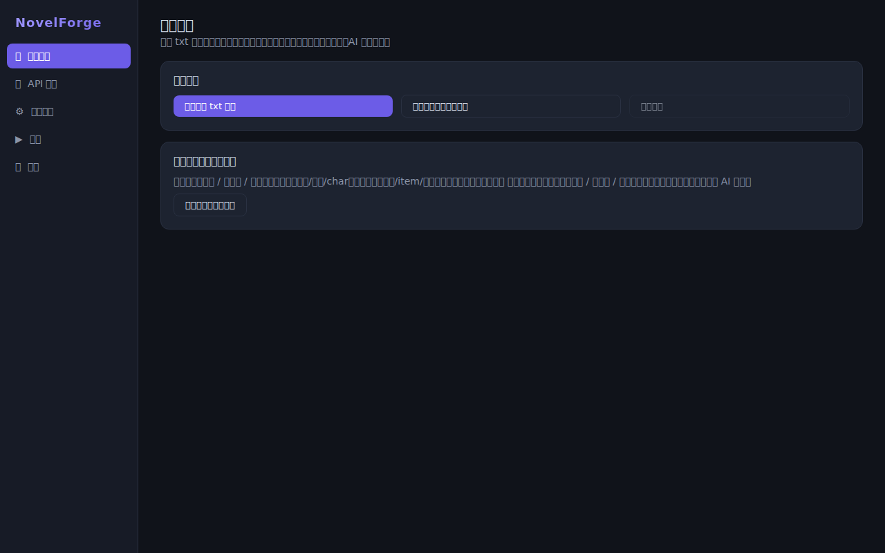
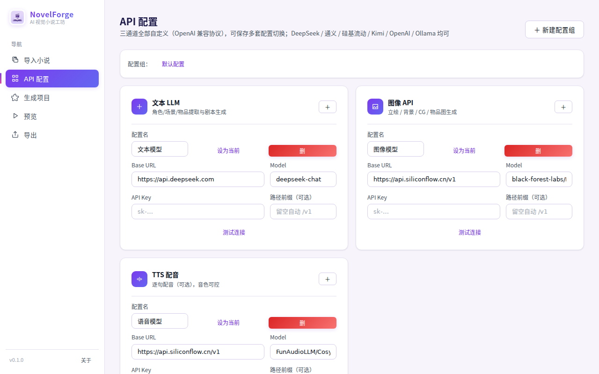
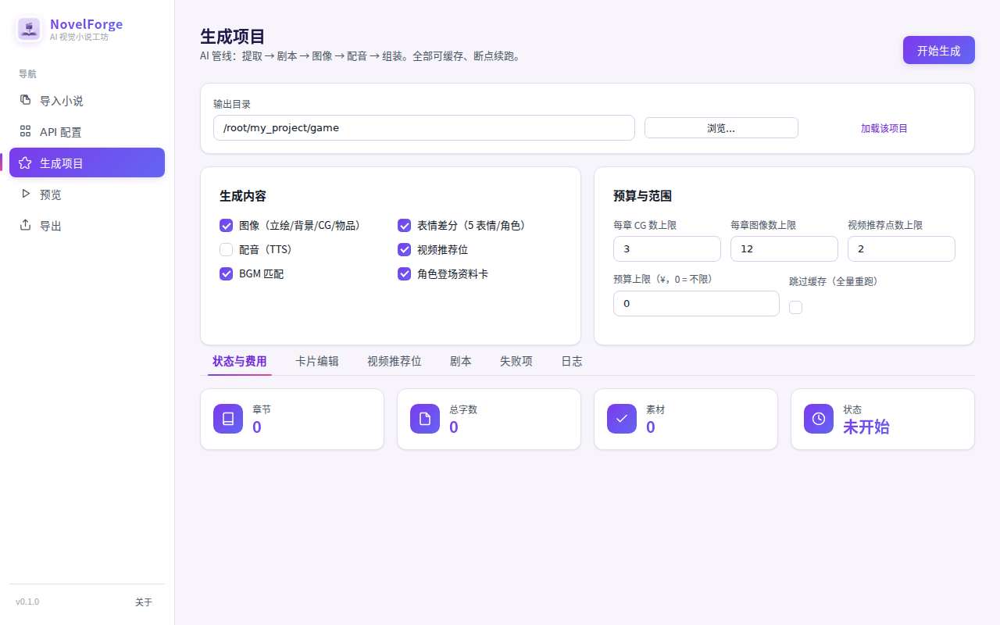
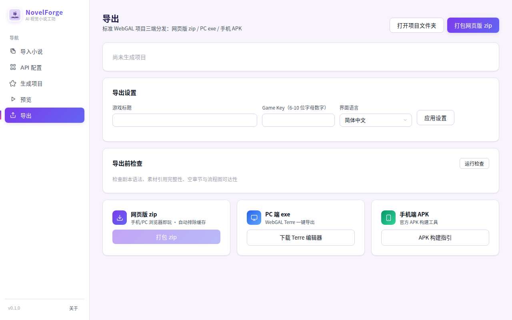
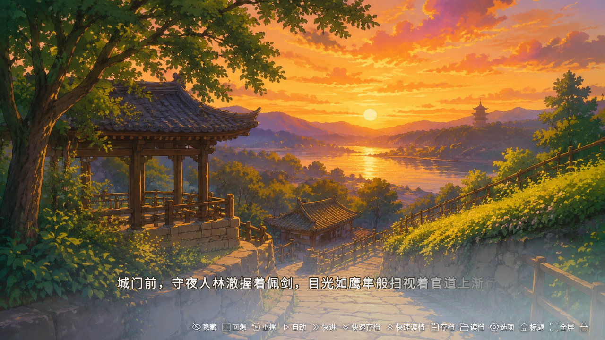

<div align="center">


# NovelForge

**One click from novel to visual novel.**

Text walls are hard to read. One click turns your novel into a playable visual novel — sprites, expressions, CGs, voice-over, BGM and branching choices, all generated automatically. Preview it, package it (exe / APK / web), and share it.

<p>
  <a href="https://github.com/carloncc/NovelForge/blob/main/LICENSE"></a>
  <a href="https://github.com/carloncc/NovelForge/releases"></a>
  <a href="https://github.com/carloncc/NovelForge/stargazers"></a>
  <a href="https://github.com/carloncc/NovelForge/issues"></a>
  <a href="https://www.forgepeaknow.com/"></a>
  
  
</p>

Tauri 2 + Vue 3 + WebGAL · Lightweight & fast · Bring-your-own API

**English** · [简体中文](README.zh-CN.md) · [日本語](README.ja-JP.md) · [한국어](README.ko-KR.md) · [Official Site](https://www.forgepeaknow.com/) · [Changelog](https://github.com/carloncc/NovelForge/releases)

</div>

---

<details>
<summary><kbd>📑 Table of Contents</kbd></summary>

- [Why NovelForge?](#why-novelforge)
- [One Click, Done](#one-click-done)
- [Quick Start](#quick-start)
- [When not to use NovelForge](#when-not-to-use-novelforge)
- [Features](#features)
- [Screenshots](#screenshots)
- [API Configuration Examples](#api-configuration-examples)
- [Visual Bible (image-generation gate)](#visual-bible-image-generation-gate)
- [Web Mode (run in the browser, no packaging)](#web-mode-run-in-the-browser-no-packaging)
- [Universal Adapter (image / TTS)](#universal-adapter-image--tts)
- [Output Structure (standard WebGAL project)](#output-structure-standard-webgal-project)
- [Development & Testing](#development--testing)
- [Architecture](#architecture)
- [Community](#community)
- [Contributing](#contributing)
- [Disclaimer](#disclaimer)
- [Credits & License](#credits--license)
- [Roadmap](#roadmap)

</details>

## Why NovelForge?

| | Why |
|---|---|
| 🪄 **One click, zero manual work** | Making a visual novel by hand means painting every sprite, staging every scene and recording every line. NovelForge automates all of it: import the novel, press generate, and get a finished, playable game you can distribute. |
| 🎬 **Watch the story, don't read it** | Text carries the story, but sprites with expressions, scene CGs, voice-over and BGM add the immersion plain text can't — all generated automatically, no manual visual work. |
| 🔥 **For the novels nobody else adapts** | Popular works get adaptations and translations; niche novels rarely get either. NovelForge targets exactly this gap: turn your niche story into a shareable visual novel, with built-in multi-language translation (zh / en / ja / ko). |

## One Click, Done

```
novel.txt ─▶ one click ─▶ sprites · expressions · CGs · backgrounds ─▶ voice-over · BGM ─▶ playable visual novel
    AI pipeline: split → translate → extract → script → images → voice → assemble          └─▶ preview / exe / APK / web zip
```

> Bring your own API key (no key? demo mode runs the full pipeline with a built-in sample novel). When images are enabled, one style confirmation step (Visual Bible) is required before batch generation.

## Quick Start

### Download the app

| Platform | Where to get it |
|---|---|
| Windows / macOS / Linux | [Latest release](https://github.com/carloncc/NovelForge/releases) (no Rust/Node needed) |
| Any platform (browser) | Web demo — no install, runs in the browser (see below) |
| Official site | [https://www.forgepeaknow.com/](https://www.forgepeaknow.com/) — web demo & news |

> No API key? The app drops into demo mode (built-in sample novel) and runs the full pipeline — try it before configuring anything.

### Run the web demo (no install, no packaging)

```bash
git clone git@github.com:carloncc/NovelForge.git
cd NovelForge
pnpm install
pnpm prepare:template   # download the WebGAL engine template (first run only, ~75MB, auto-pruned)
npm run dev             # open http://localhost:5173 in your browser
```

### Run the desktop app in development

```bash
pnpm tauri dev
```

Requirements: Node.js 18+ · pnpm · Rust (https://rustup.rs) · Windows / macOS / Linux.

### Build & package

```bash
pnpm tauri build
```

Artifacts land in `src-tauri/target/release/bundle/` (Windows exe / macOS dmg / Linux AppImage).

### Usage flow

1. **Import novel**: pick a txt (GBK/UTF-8 auto-detected), chapters auto-split; optionally import custom assets. Multiple files are supported, or let the LLM split chapters for you
2. **Configure APIs**: fill in base_url + key + model for the text LLM (DeepSeek is the cheapest, ~$0.1–0.3/M tokens); image / TTS / vision channels can be added later but the image channel must be configured before generation
3. **Generate**: toggle features (images / expressions / voice / video slots / BGM / intro cards) → run. The text stages run first; when images are enabled, the **Visual Bible approval** gate appears first (style source → three-view sheets → approve), then image / voice / assembly run with live progress logs and cost stats. Stage-based generation lets you rerun only the stages you need, with optional human feedback for chapter splitting
4. **Preview**: play the game instantly in the embedded WebGAL engine
5. **Export**: deploy the web zip directly; follow the generated `导出说明.txt` for exe / APK

## When not to use NovelForge

- You want pixel-perfect art by a specific artist: generated sprites are AI art — great for personal projects, not for commercial art-directable releases.
- You only want a text reader (no visuals): this is a visual-novel pipeline, not an ebook reader.
- You have zero tolerance for AI-cost: generation calls vendor APIs with your own keys (demo mode is free but produces the sample project only).

## Features

| | Description |
|---|---|
| 📖 **All-in-one pipeline** | Chapter split → multi-language translation → card extraction → script (auto CG staging, item close-ups, debut intro cards, video slots) → images → TTS → standard WebGAL assembly |
| 🎨 **Background-free sprites** | Auto cutout (AI segmentation, model auto-downloaded and cached; offline-safe chroma-key fallback with connected flood-fill + edge feathering) |
| 🎨 **Style consistency** | Project-wide style anchor image + fixed seed + shared negative prompt + chain image-to-image (three-view → sprite → expressions/actions), with multimodal self-checks that verify character consistency against reference images |
| 📖 **Visual Bible gate** | Before batch image generation, a "Visual Bible" must be approved: pick a style source (uploaded reference analyzed by the vision model, or a style sample generated from a full-novel analysis) plus three-view sheets (front/side/back) for every protagonist. Re-generating one character's three-view does not affect others. Any change invalidates approval |
| 😊 **Expression variants** | 5 expressions per character (normal sprite used as reference for consistency); dialogue auto-switches by emotion |
| 🏃 **Action sprites** | Action poses (e.g. sword draw / waving / arms crossed) generated from the three-view sheet for consistent identity |
| 🔀 **Branching choices** | The LLM detects decision points and generates 2-3 options; each branch rejoins the main line (WebGAL choose / label / jumpLabel) |
| 🎬 **Chapter title cards** | Fullscreen title sequence at the start of each chapter |
| ✨ **Scene impact** | Whole-scene CG for key moments, item close-up staging, first-appearance character intro cards |
| 🎬 **Video slots** | AI marks cinematic moments and writes video prompts; drop in videos (e.g. from Jimeng/Kling) with the prescribed filename to enable them (zero API cost) |
| 🎙️ **Voice-over with selectable voices** | Sentence-level TTS, configurable voice library, AI picks a fitting voice per character, graceful degradation on failure |
| 🎵 **BGM** | Music files auto-matched to atmosphere keywords; cross-fade stop on scene/chapter change, BGM gallery unlock |
| 🔌 **Fully configurable APIs** | Four independent channels (LLM / vision / image / TTS), each with its own base_url + api_key + model (OpenAI-compatible protocol), multiple presets with test buttons; image channel exposes capabilities (reference-image count, img2img, seed) with automatic model capability detection |
| 🗂️ **Material-first** | Import character/item/background images with manual mapping; the pipeline prefers your assets and only generates what is missing |
| ♻️ **Cost control** | Full disk caching, resume from breakpoints, chapter-level reruns, abort button, token/cost stats, pre-generation budget limits (auto-abort), failed-task list with targeted retry, on-disk logs |
| 💾 **State persistence** | Novel / materials / options / results auto-saved per project; AI chapter splits snapshotted so restarts never lose chapters; recent-project history |
| 📦 **Three-target export** | Web zip (caches auto-excluded), export lint, export settings (title · game_key · UI language), PC exe via WebGAL Terre, Android APK via official build tool |
| 🔒 **Security** | LLM output injection protection, CSP, zero known CVEs in dependency audit |

## Screenshots

| Import novel | API config | Generate |
|---|---|---|
|  |  |  |

| Export | Game title | Game story |
|---|---|---|
|  |  |  |

## API Configuration Examples

| Service | Channel | Base URL | Example model |
|---|---|---|---|
| DeepSeek | LLM | `https://api.deepseek.com` | `deepseek-chat` |
| SiliconFlow | Vision | `https://api.siliconflow.cn/v1` | `zai-org/GLM-4.6V` |
| SiliconFlow | Image (ref-image) | `https://api.siliconflow.cn/v1` | `Qwen/Qwen-Image-Edit-2509` |
| SiliconFlow | Image | `https://api.siliconflow.cn/v1` | `black-forest-labs/FLUX.1-schnell` |
| SiliconFlow | TTS | `https://api.siliconflow.cn/v1` | `FunAudioLLM/CosyVoice2-0.5B` |
| OpenAI | LLM | `https://api.openai.com/v1` | `gpt-4o-mini` |
| Kimi | LLM | `https://api.moonshot.cn/v1` | `moonshot-v1-8k` |
| Ollama (local) | LLM | `http://localhost:11434/v1` | `qwen2.5:7b` |

**Vision channel**: handles everything that must "see" images (style-reference analysis, character-reference verification, image self-checks). It is independent of the text LLM, so it works even if your text model cannot take images. New setups default vision to SiliconFlow `zai-org/GLM-4.6V` and image to `Qwen/Qwen-Image-Edit-2509` (up to 3 reference images / img2img). Legacy 3-channel configs are migrated automatically on first load.

## Visual Bible (image-generation gate)

When image generation is enabled, the project must have an **approved Visual Bible** before batch generation (text extraction / scripting is unaffected):

- **Style source** (choose one): upload a reference image (analyzed by the vision channel and used as the global style anchor), or let the LLM analyze the whole novel and generate a character-free style sample.
- **Character three-views**: each protagonist gets front / side / back sheets, individually regenerable, optionally from an uploaded character reference — this affects only that character, never backgrounds/CGs or other characters.
- **Approve & continue**: confirm each character → approve the Bible → image/voice/assembly resume automatically. Any change to the novel, characters, or style invalidates approval and requires re-confirmation.
- **No silent degradation**: unsupported reference-image models fail with `REFERENCE_UNSUPPORTED`; missing reference files fail with `REFERENCE_MISSING`. An unconfigured vision channel raises a clear setup hint.

**Storage**: everything lives under the project output dir `.novel2vn/visual-bible/` (manifest `visual-bible.json` stores relative paths / prompts / approval state — no base64 blobs; images are `style-reference.*`, `style-sample.png`, `threeview_<charID>.png`, …). If a reference is reported missing, the folder was moved or deleted: restore the files or re-upload/re-generate in the Visual Bible panel.

## Web Mode (run in the browser, no packaging)

```bash
npm run dev          # or pnpm dev, then open http://localhost:5173
```

The web build has the same features as the desktop app, backed by browser-native equivalents:

| Desktop (Tauri) | Web mode |
|---|---|
| Local filesystem | IndexedDB virtual filesystem (persisted in the browser) |
| Rust HTTP client (no CORS limits) | Dev-server proxy relay (`/__novelforge/proxy`) |
| Embedded preview server | Frontend zips the game → dev server extracts and serves it (same-origin iframe) |
| Rust rembg cutout | Canvas connected flood-fill chroma-key cutout (white/black background removal) |
| Bundled WebGAL engine template | On-demand sync of `src-tauri/templates/webgal` into IndexedDB |
| Native file dialogs | Browser `<input type="file">` |
| Export zip to disk | Export zip auto-downloads |

> Production: `npm run build` + `npm run preview` (the preview server ships the same proxy/preview middleware and can be reverse-proxied).
> Static hosting without any backend falls back to direct browser calls (requires the vendor to support CORS).

## Universal Adapter (image / TTS)

Vendor image/voice protocols differ wildly (OpenAI-compatible / MiniMax proprietary / Alibaba task-polling). NovelForge ships a **config-driven universal adapter engine** (`sync`/`async` modes + field-mapping templates); pick a "vendor template" in the config page:

| Vendor | Image | TTS |
|---|---|---|
| OpenAI-compatible (Zhipu CogView / OpenAI) | ✅ openai-image | ✅ openai-tts |
| SiliconFlow (FLUX, recommended) | ✅ siliconflow-image (seed / negative prompt / img2img) | ✅ openai-tts |
| MiniMax (image-01 / speech-2.8) | ✅ minimax-image | ✅ minimax-tts (HEX auto-decode) |
| Alibaba DashScope (wanx-v1 / CosyVoice) | ✅ dashscope-image (task polling, seed / negative prompt) | ✅ dashscope-tts |

Additional built-ins: **Google Gemini** (`/v1beta/models/{model}:generateContent`, inlineData auto-extraction) and **Stability AI** (multipart/form-data, raw binary response). The engine auto-parses vendor error bodies (`base_resp` / `error.message` / `output.message` …) into readable messages.

Any new vendor: paste a JSON template under "Advanced → Custom adapter template" — no code changes needed. Reference-image capability (count 0–3, img2img, seed) is configured per model in the image channel's capability settings, with automatic capability probing; the Visual Bible then drives character consistency. If the model lacks reference-image support or the reference file is missing, the pipeline errors explicitly instead of silently falling back to text-to-image.

## Output Structure (standard WebGAL project)

```
output-dir/
├─ index.html, assets/          # WebGAL engine (bundled)
├─ 导出说明.txt                 # export guide: exe / APK / web zip steps
├─ video_plan.txt               # AI-suggested video slots (prompts)
└─ game/
   ├─ config.txt                # game configuration
   ├─ scene/start.txt, ch*.txt  # script (plain text, directly editable)
   ├─ background/  figure/  vocal/  bgm/  video/
   └─ .novel2vn/                # cache & intermediates (safe to delete)
      └─ visual-bible/          # Visual Bible: manifest + style refs + three-views
```

## Development & Testing

```bash
# Unit & end-to-end tests (Node)
npx tsx tests/unit-render.ts      # render injection boundaries
npx tsx tests/unit-chapters.ts    # chapter-split boundaries
npx tsx tests/unit-cache.ts       # cache / resume consistency
npx tsx tests/unit-tasks.ts       # image task building
npx tsx tests/unit-material.ts    # material-first matching
npx tsx tests/unit-features.ts    # intro cards / expressions / BGM / video slots
npx tsx tests/unit-persist.ts     # state persistence
npx tsx tests/unit-retry.ts       # API retry mechanism
npx tsx tests/unit-dedupe.ts      # scene id dedup
npx tsx tests/unit-universal.ts   # universal adapter engine (all vendor templates)
npx tsx tests/unit-vfs.ts         # IndexedDB virtual filesystem
npx tsx tests/e2e-demo.ts         # end-to-end pipeline (demo novel)

# Real-engine check (loads the generated game in a headless browser)
npx tsx tests/engine-check.ts <project-dir>

# Rust-side tests (chroma-key cutout)
cd src-tauri && cargo test
```

## Architecture

```
┌────────────────────────────────────────────┐
│  NovelForge (Tauri 2 + Vue 3 + TypeScript) │
│  ├─ pages: Import / Config / Generate /    │
│  │          Preview / Export               │
│  ├─ core:  split → translate → extract →   │
│  │          script → images → voice →      │
│  │          render → project               │
│  ├─ api:   OpenAI-compatible adapters      │
│  │          (LLM / vision / image / TTS)   │
│  └─ Rust:  file IO / HTTP relay / preview  │
│            server / chroma-key cutout /    │
│            config storage                  │
└───────────────┬────────────────────────────┘
                ▼ standard WebGAL project
┌────────────────────────────────────────────┐
│  WebGAL engine (MPL-2.0, unmodified)       │
│  Preview (embedded) / exe (Terre) /        │
│  APK (official tool)                       │
└────────────────────────────────────────────┘
```

## Community

- [Official site](https://www.forgepeaknow.com/) — web demo & latest news
- [Issues & feature requests](https://github.com/carloncc/NovelForge/issues) — bugs, ideas, feedback
- [Discussions](https://github.com/carloncc/NovelForge/discussions) — show off games you made, ask questions
- [WebGAL](https://github.com/OpenWebGAL/WebGAL) — the engine powering the output; its community knows WebGAL scene scripting

[](https://star-history.com/#carloncc/NovelForge&Date)

Show off the visual novels you generate — that's the whole point of this tool.

## Contributing

Contributions of all kinds are welcome — bug reports, feature ideas, translations, and code.

- Report bugs or request features via [Issues](https://github.com/carloncc/NovelForge/issues)
- Join the conversation in [Discussions](https://github.com/carloncc/NovelForge/discussions)
- For code changes, run the test suite before opening a PR (see [Development & Testing](#development--testing))

**Principal Maintainer:** [@carloncc](https://github.com/carloncc)

## Disclaimer

This software is provided "as is" without warranty of any kind. By using NovelForge, you acknowledge and agree that:

- **You are solely responsible** for all AI-generated content (images, voice-over, script) produced with this tool, and for how you use, publish, or distribute it. The authors have no control over model outputs and accept no liability for them.
- **Only use content you have the right to use.** Feed in novels you own or are authorized to adapt. Generated output may be subject to the terms and conditions of the AI service providers whose APIs you configure.
- **Third-party API costs and terms are your responsibility** — NovelForge calls the providers you configure with your own keys. Monitor your own usage and billing.
- **Do not generate unlawful or infringing content** — including copyrighted characters, real people's likenesses, or hateful and harmful material. You are responsible for compliance with all applicable laws and platform policies.
- **Keep required attributions**: works published with NovelForge must retain the WebGAL copyright notice (see [LICENSE](./LICENSE)).

## Credits & License

- [WebGAL](https://github.com/OpenWebGAL/WebGAL) — visual novel engine (MPL-2.0); see [THIRD_PARTY_NOTICE](./THIRD_PARTY_NOTICE)
- NovelForge itself is [MIT](./LICENSE) licensed
- Published works must retain the WebGAL copyright notice; game content belongs to the creator

## Roadmap

- [x] Style consistency: anchor image + fixed seed + negative prompt + chained img2img (incl. fix for missing default sprites)
- [x] Branching choices (choose / jumpLabel, LLM-tagged decision points)
- [x] Chapter title cards / title screen (Title_img / Title_bgm) / BGM auto cross-fade & gallery unlock
- [x] Visual Bible gate: style reference + character three-views + approval workflow
- [x] Stage-based generation with human feedback (AI chapter split), multi-file import, multi-language translation
- [ ] More expression / costume variants (expression-diffusion img2img)
- [ ] AI music generation channel (fully automatic BGM)
- [ ] Transition animations (background scene effects)
- [ ] In-game character gallery
- [ ] Narration voice (monologue voice)
- [ ] Lip-sync for sprite portraits
