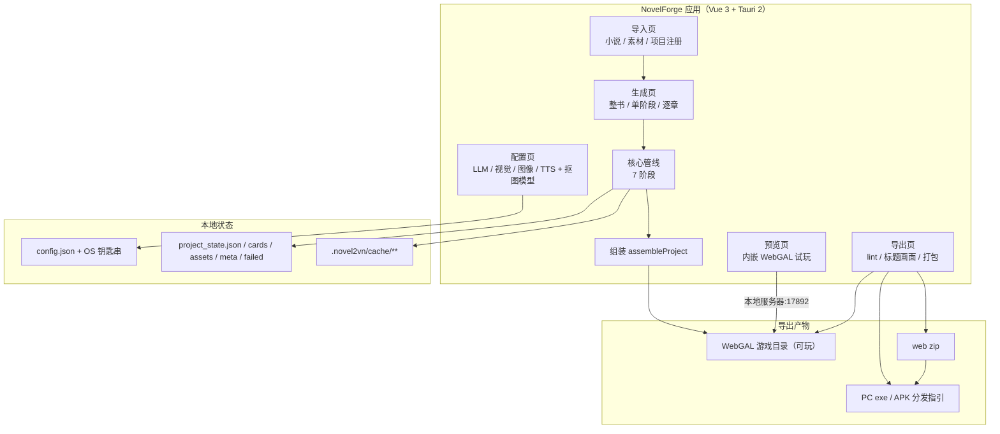
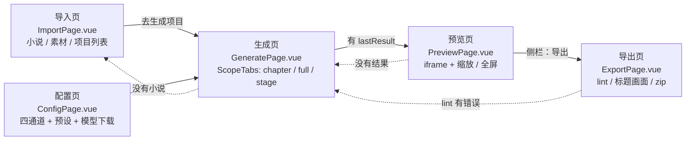
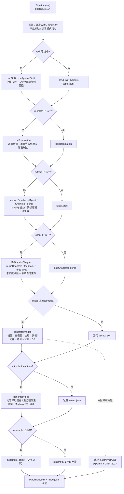
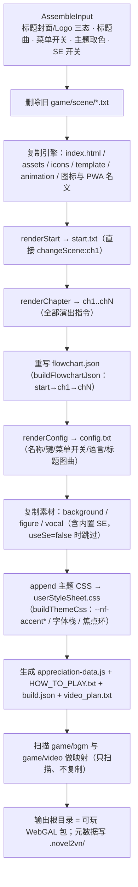
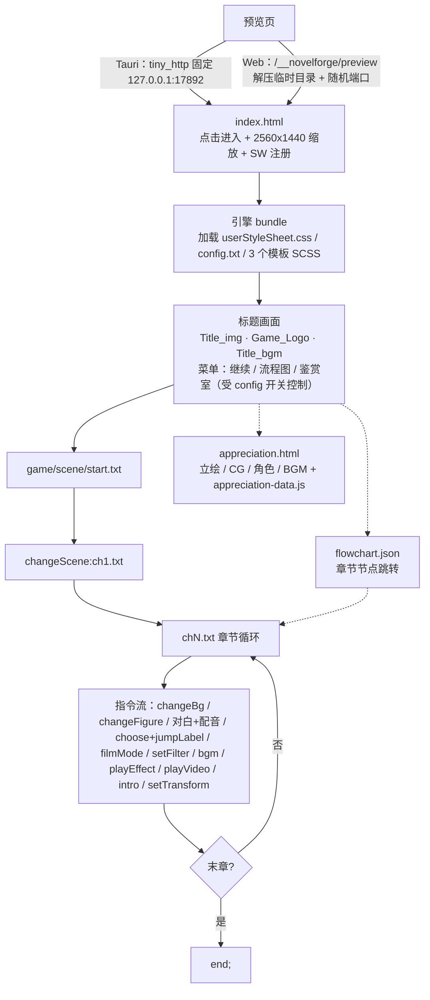
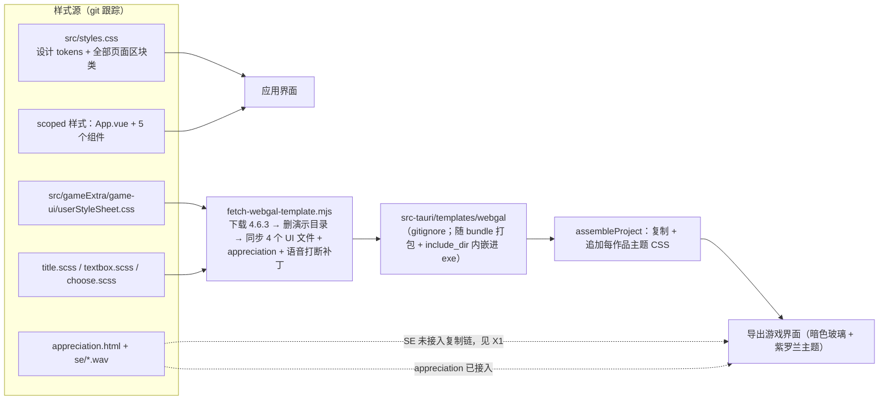
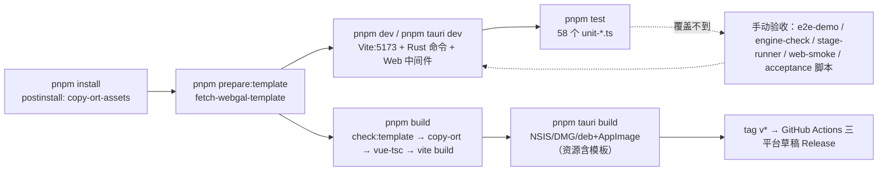
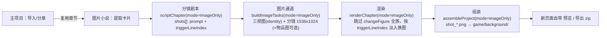

# NovelForge 全链路功能流程图（代码 × 样式 × 工具链）+ 审计

> 基线：当前工作区未提交版本（2026-09-18）。所有行号来自当前源码。
> 查看方式：VS Code 安装 Markdown Preview Mermaid 插件，或贴到 mermaid.live / GitHub 预览。
> 相关事实来源：`src/core/types.ts:355-367`（阶段模型）、`src/core/pipeline.ts:1147`（run 入口）、`src/core/project.ts:49`（组装入口）、`src/core/render.ts`（WebGAL 指令输出）、`scripts/fetch-webgal-template.mjs`（模板同步）。

---

## 0. 总览

- 应用层没有 vue-router / Pinia：`src/App.vue:16-22` 用动态组件切页，`src/stores/nav.ts:4` 的 5 个页面 id 即全部路由。
- 生成是「单例状态机」：`src/stores/generate.ts` 常驻，切页不打断；全局停止/失败徽标走轻量 `runStatus`（`App.vue:14,104-108`）。

---

## 1. 应用层：页面与导航

页面内的功能线路（要点）：

| 页面 | 功能线路 | 核心调用 |
|---|---|---|
| 导入页 | 选 txt（多选合并）/ 演示小说 / 章节标题与启用开关 / 素材分类 / 项目列表打开·删除·新建 / 同名小说防串项目 | `chapters.importNovelFile(s)`、`project.restoreProject`、`projects.decideNovelImport` |
| 配置页 | 四通道（llm/vision/image/tts）× 多配置 × 预设组；/models 自动发现；测试连接；MiniMax 音色库；图像能力矩阵；AI 抠图模型下载 | `openaiCompatible.testLlm/testVision/testTts/testImage`、`cutout/download` |
| 生成页 | ProjectBar → OptionsPanel → 范围切换（逐章/整书/单阶段）→ ResultSection（run/failed/log/script/asset/cards/bible/video 八个页签） | 统一经 `generate.execute()` → `new Pipeline().run()`（`stores/generate.ts:1489,1638-1687`） |
| 预览页 | 启动/停止本地静态服务器、iframe 加载、鉴赏室、系统浏览器打开、缩放 50–150%、全屏 | `tauri.startPreviewServer/stopPreviewServer/openUrl` |
| 导出页 | 应用 config（GameKey/语言/标题）/ 标题画面卡片（封面·Logo 三态、标题曲、菜单开关、主题取色）/ lint 预检 / 打包 zip / 分发指引 | `render.renderConfig`、`lint.lintProject`、`execute({stages:["assemble"]})`、`tauri.buildZip` |

生成页运行路径（同一入口的 5 种触发）：

| 触发 | 入口 | 管线参数特征 |
|---|---|---|
| 整书生成 | `FullRunPanel.start()` | 勾选阶段全集，`clearLogsFirst` |
| 单阶段重跑 | `StageStatusBoard.regen(stage)` → `runStageRegen` | `[stage]` + 可选 `cascadeDownstream()` 自动补下游（`stageCascade.planStageCascade`） |
| 逐章生成 | `runChapterFullRegen` / `runChapterPartRegen` | `rerunChapters:[idx]` + `forceXxxChapters` + `requireFullScriptCoverage` |
| 章节队列 | `runChapterBatchInner` | 每章全量、最后一次 assemble |
| 视觉圣经恢复 | `resumeAfterVisualApproval` | `visualBibleWorkflow.resumeStagesAfterVisualApproval` |

---

## 2. 生成管线：`Pipeline.run()` 七段

阶段与缓存（一条主线，缓存是旁路）：

| 阶段 | 产物 / 缓存 | 局部重跑定位参数 |
|---|---|---|
| split | `.novel2vn/split.json`（文本指纹） | `forceStages:["split"]`、feedback.split |
| translate | `.novel2vn/translate/translate_<lang>_<titleHash>_<textHash>.json` | `language`、forceStages |
| extract | `cards.json` / `cards_demo.json`（`_novelFp`） | forceStages、cards 变更分级失效 |
| script | `cache/script_ch<N>_<title>_<text>[_st<style>].json` + verify 报告 | `rerunChapters`、`forceScriptChapters`、`feedback.script[ch]` |
| image | `cache/images/{anchor_style, threeview_*, figure_*, bg_*, cg_*, item_*}` + `.visual-bible-fingerprint` | `forceImageChapters`（只强推该章 bg/CG）、单章时角色/道具按出场过滤 |
| voice | `cache/vocal/v_<key>_<voiceFp>_<textHash>.<ext>` | `forceVoiceChapters`、feedback.voice |
| assemble | `game/**` + `.novel2vn/meta.json` | `requireFullScriptCoverage` 防单章覆盖整包 |

关键分支语义（画流程图时别画错）：

- 未选中的阶段不是「跳过」，而是 `load*()` 从磁盘复用（`pipeline.ts:444/784/1107/491/569/574`）。
- 演示模式（无 `llm.apiKey`）走 `demoExtract`/`demoScriptAll`，不需要任何 API。
- 中止是协作式：`abort()` 置位，边界与执行器检查；在途付费请求完成且产物保留（`pipeline.ts:2113`）。
- 失败不中断同类后续任务（translate/script/image/voice 都是「记录 + 继续」），只有 split/extract 致命错、视觉自检配置错会抛出。

---

## 3. 组装阶段：`assembleProject()`

- 标题艺术：Canvas 生成 `nf_title_cover.png` / `nf_game_logo.png` 或复制自定义图（`project.ts:339-475`）。
- 主题取色：候选 anchor → 首张 bg → 首张 cg，落回默认紫罗兰（`project.ts:132-144`）。
- BGM：`detectBgm` 按文件名关键词分类并给场景选曲；标题曲可指定/关闭（`project.ts:718-760`）。
- 视频：用户放入 `game/video/video_<id>.mp4` 即被剧本引用；否则输出占位注释（`project.ts:685-700`）。

---

## 4. 导出游戏运行时（WebGAL 4.6.3）

与代码的一致性核对（本图已按真实代码绘制）：

- `start.txt` 当前只有 `changeScene:ch1.txt;`（教程/OP 已移除）；末章直接 `end;`（制作名单已移除）。
- 流程图 JSON 是单图 `start→ch1→…→chN` 链（`project.ts:510-530`），与场景文件一一对应。
- 鉴赏室数据由组装生成 `appreciation-data.js`（角色/CG/BGM），页面从模板复制（`project.ts:273-317`）。

---

## 5. 样式体系（应用 + 导出游戏）

样式结构要点：

- 应用样式是「单文件 tokens + 全局类」体系：`src/styles.css` 约 2500 行，按 reset → tokens → sidebar → 页面/控件 → 视觉圣经 → 导出/素材分区块；仅 `App.vue`、`StageStatusBoard`、`LazyThumb`、`ScopeTabs`、`ChapterWorkbench`、`AboutDialog` 带 scoped 样式。
- 游戏皮肤源头是 `src/gameExtra/**`；模板目录每次 `prepare:template` 从源头回填，因此改皮肤必须改 `gameExtra`（模板目录被 gitignore）。
- 每作品主题 CSS（`--nf-accent*`、按语言字体栈、标题常显、焦点环、窄屏）由组装追加到 `userStyleSheet.css`，带幂等标记（`project.ts:477-573`）。

---

## 6. 工具链：开发 / 构建 / 测试 / 发布

- 双运行时：桌面（Rust 命令 + tiny_http 预览）与 Web（Vite 中间件模拟 IO/代理/预览/模型下载），流程图第 4 节已分开画。
- 单元测试自动注册：文件名 `tests/unit-*.ts` 即被 `scripts/run-tests.mjs:13-15` 收集；其余 `.ts/.mjs` 均为手动工具。
- CI 仅在打 tag 时跑构建发布，不跑测试与 i18n 检查（`.github/workflows/build.yml`）。

---

## 7. 审计：差异 / 多余 / 缺陷 / 无用分支

### 7.1 代码与流程图的差异（D）

| # | 差异 | 证据 | 处理 |
|---|---|---|---|
| D1 | 直觉中的 `recognize / lint / cards / bgm / render` 不是管线阶段：真正的 7 段是 `split/translate/extract/script/image/voice/assemble` | `core/types.ts:355-367`；`lint` 仅导出页调用 `ExportPage.vue:81`；`recognize` 仅在视觉圣经/图像内部；`detectBgm` 在组装内 `project.ts:718` | 本文档流程图已按 7 段画；文档/需求描述勿再写「lint 阶段」 |
| D2 | 已移除功能若仍出现在旧流程图即为过期分支：教程/OP/片尾名单、miniAvatar、待机呼吸 | 本会话回退；`renderStart` 只有 `changeScene`；末章直接 `end`（`render.ts:537-544`） | ReqFlow 对应 9 条已标记「已废弃」 |
| D3 | `RenderOptions.title / gameKey` 声明了但全文件 0 次读取，调用方仍在传 | `render.ts:12-14`（无 `opts.title`/`opts.gameKey` 引用）；`project.ts:152-155` | 删除字段或接线使用 |
| D4 | `PipelineEvent.costDelta` 从未被赋值，也无人读取 | `types.ts:510` | 删除或补上成本事件 |
| D5 | `useSe` 默认值注释与代码相反：注释写「默认关闭」，实际 undefined = 开启 | 注释 `types.ts:26`、`render.ts:27`；代码 `render.ts:449`（`opts.useSe === false ? null : detectSe`）；e2e 未配置即输出 `playEffect` | 统一注释（或改默认值） |
| D6 | 「内置 SE 随模板分发」这条链路在实际构建中不成立 | 见 X1 | 修复脚本 |
| D7 | 预览有两套实现（桌面固定端口 / Web 随机端口），单泳道流程图会失真 | `server.rs:32-64`；`vite.config.ts:338-435` | 流程图已双分支 |
| D8 | lint 白名单与 render 实际输出不一致 | 见 X2/X3 | 修复 `lint.ts:24` |

### 7.2 多余的功能（R：死代码 / 重复 / 遗留物）

| # | 项 | 证据 | 建议 |
|---|---|---|---|
| R1 | 完全无引用的导出：`jsonKey`、`slugify`、`isReferenceDescriptionDisabled`、`splitChaptersForRestore`、`isWeb`（与 `tauri.ts:6` 私有实现重复）、类型 `ChapterAdjust/LogSink/HttpRequest` | `cache.ts:35,39`、`recognize.ts:128`、`persist.ts:336`、`webRuntime.ts:14`、`chapters.ts:59`、`types.ts:531`、`tauri.ts:28` | 删除 |
| R2 | 25 个既无 src 引用也无测试引用的导出（如 `DEFAULT_PRICES`、`imageSeedFor`、`PRESET_TEMPLATES`、`callUnified`、`demoScriptChapter`、`SPEECH_VERBS`、`SCAN_TOOLS`、`describeReferenceImage`、`NovelForgeError`、visualBible 的 8 个路径/签名助手等）；另有 63 个仅测试导入（export 只为测试钩子） | 各文件声明处 | 降到非导出或标注 `@internal` |
| R3 | 死参数/死字段：`BuildImageTaskOptions.figurePerCharacter`（5 处调用仍传）、`ImageRunOptions.retryDelayMs`（文档说可调，实际硬编码 `images.ts:1090`）、`regenerate.ts:62 metaDirFor` | 同上 | 清理 |
| R4 | 重复实现：`fileToBase64` ×4、`b64encode` ×2、`imageMimeForPath` ×2、同名不同义 `visualBibleArtifactPath` ×2、两版 `authHeaders`、`emotionOf` vs `emotionFromTag`、`stableHash` 同名不同算法、`normalizePath` 同名 | `ImportPage.vue:158`/`EditCards.vue:302`/`VisualBiblePanel.vue:133`/`generate.ts:813` 等 | 收敛到 utils |
| R5 | 冗余代码：`render.ts:473-474` 局部再声明遮蔽 224-225 同名变量；`generate.ts` 8 处 `if (ok){ if(ok){...} ...}` 嵌套重复；legacy re-export `normalizeBaseUrl`、`ModelNotInstalledError` | 同上 | 清理 |
| R6 | 遗留文件/脚本：`stable-style/`、`OPTIMIZATION_REPORT.md`、`OPTIMIZATION_SUMMARY.md`、`QUICK_FIX.md`、`verify-optimization.ps1`、`debug.log`、`.tmp-probe.diff`、`scripts/serve-game-tmp.mjs`（硬编码 D:/Desktop/视觉小说 路径）、`scripts/run-ts-loader.mjs`（已被 tsx 取代）、`src-tauri/src/config.rs`（模块未声明 + `save()` TODO）、`src-tauri/examples/cutout_file.rs`、`tests/` 下 37 个 `.tmp-*` 与 3 个 `/root/` 硬编码脚本 | 文件本身；`.gitignore:11,20`；`lib.rs:1-4` | 删除或移入 tools/ 归档 |
| R7 | 应用样式缺陷 token（也算缺陷，归 R）：`--accent-2` 未定义、`--success` 未定义 | 见 X4/X5 | 补 token |

### 7.3 缺陷的功能（X）

| # | 缺陷 | 影响 | 证据 | 修复 |
|---|---|---|---|---|
| X1 | 内置 SE 断链：`fetch-webgal-template.mjs` 的 REMOVE 会删掉模板 `game/vocal`，同步步骤不恢复 SE；`gen-se.mjs` 未接入任何 npm 脚本；CI 全新检出直接 `prepare:template` → 发布包模板没有 `se_*.wav`，但 `assembleProject` 仍会复制「模板里的 SE」 | 开启 SE 的用户包内 `playEffect:se_*.wav` 指向不存在文件（lint 会报 8 条），本机模板恰好有 SE 所以开发者不易发现 | `fetch-webgal-template.mjs:24-31,64-103`；`gen-se.mjs:12`；`project.ts:255-271`；`build.yml:48-49` | 在 fetch 脚本加 `ensureBuiltinSe()`：`src/gameExtra/se → template/game/vocal`（或 CI 校验） |
| X2 | lint 白名单缺 `filmMode`/`setFilter`：被 `LINE_RE` 当对白解析 | 命令数/行数虚增，资源与语法校验跳过；`tests/unit-lint.ts` 未覆盖 | `lint.ts:24,26` vs `render.ts:409,413-414` | 扩充 `CMD_RE` 并加单测 |
| X3 | lint 白名单含无生产者指令 `miniAvatar/setTransition/setComplexAnimation` | 误导（以为支持），且前两者本会话已删除输出 | `lint.ts:24`；引擎 bundle 支持但 render 不产出 | 留作兼容可接受，但注释说明「未来扩展」 |
| X4 | `--accent-2` 未定义：用 `var()` 无回退 → 颜色/背景失效 | 素材行颜色、阶段状态点视觉异常 | `styles.css:1118`、`StageStatusBoard.vue:104,119`；`:root` 无定义 | 改用 `--accent` 或补 token |
| X5 | `.cutout-status.ok` 用 `var(--success, …)`：token 名不存在（项目用 `--ok`），仅靠 fallback 生效 | 主题改动时不同步 | `styles.css:1557` | 改 `var(--ok)` |
| X6 | 导出 `index.html` 的 `<title>` 仍是 `WebGAL`，仅 PWA name/short_name 被替换 | 浏览器标签/收藏名称与作品不符 | 模板 `index.html`；`project.ts:619-629` | 组装时替换 title |
| X7 | 视觉自检配置错误会中止整个 image 阶段（VisionApiError 直接抛）而其他任务失败是记录并继续 | 配置错时整段无产出（行为本身合理，但流程图需画出「硬失败」分支） | `pipeline.ts` image 段；`selfcheck.ts` | 文档标注即可 |
| X8 | `src-tauri/src/config.rs`：模块未挂载、`save()` TODO；若未来有人挂载会造成两套配置读写 | 死代码误导 | `lib.rs:1-4`；`config.rs:26-29` | 删除文件 |

### 7.4 流程图上无用分支（B：不应画的幽灵分支 / 不可达路径）

| # | 分支 | 原因 | 证据 |
|---|---|---|---|
| B1 | 教程 / OP 片头 / 片尾制作名单分支 | 本会话已按产品决策移除 | `render.ts renderStart` 仅 `changeScene`；末章 `end` |
| B2 | 「管线内自动 lint 卡点」分支 | lint 只由导出页手动触发，不在 `Pipeline.run` 中 | `ExportPage.vue:81`；`pipeline.ts` 无 `lintProject` |
| B3 | `costDelta` 成本事件分支 | 字段从未赋值 | `types.ts:510` |
| B4 | 「自定义重试间隔 `retryDelayMs`」分支 | 配置项从未被读取 | `images.ts:615-616` vs `:1090` |
| B5 | `figurePerCharacter` 配置分支 | 读入后未使用 | `images.ts:245,276` |
| B6 | `RenderOptions.title/gameKey` 输入分支 | 从未读取 | `render.ts:12-14`；零引用 |
| B7 | `miniAvatar / setTransition / setComplexAnimation` 指令分支 | 白名单接受但 render 无生产者（本会话已删 miniAvatar/待机呼吸） | `lint.ts:24`；`render.ts` |
| B8 | 「未选阶段 = 跳过」分支 | 实际是磁盘复用 `load*()` | `pipeline.ts:444/784/1107/491/569/574` |

已验证「不是」死分支的部分（避免误删）：

- 7 个 `StageKey` 全部有真实处理逻辑（`pipeline.ts` 对应 run 段），UI 也全部可触发。
- `generate.ts` 全部 switch 分支可达；`visualBibleWorkflow`、`stageCascade` 的计划函数均被 store 实际调用。
- 预览的桌面/Web 两条实现都在用（Tauri 与 Web 运行时分流）。
- WebGAL 的 `Enable_Continue/flowchart/Appreciation` 是引擎真实支持的键，已核对引擎 bundle。

### 7.5 优先级建议

1. X1（发布包 SE 缺失）→ 一行脚本改动，影响交付质量。
2. X2（lint 缺口）+ D3/D4/D5（死字段/错误注释）→ 低成本，消除误导。
3. X4/X5/X6（样式与标题 token）→ 视觉一致性。
4. R6（遗留文件与 `.tmp-*` 清理）→ 仓库卫生；`run-ts-loader.mjs`、`config.rs`、`serve-game-tmp.mjs` 可直接删。
5. R2/R4（死导出与重复实现）→ 分批收敛，先处理有维护风险的 `visualBibleArtifactPath`、`authHeaders` 两处同名不同义。

### 7.6 修复批次记录（2026-09-18，全部已落地）| 类别 | 处理结果 |
|---|---|
| X1 | `fetch-webgal-template.mjs` 新增 `ensureBuiltinSe()`：从 `src/gameExtra/se` 幂等同步 `se_*.wav` 到模板 `game/vocal`；本地重跑校验 8 个文件哈希一致，e2e 组装后 lint 0 错误 |
| X2/X3 | `lint.ts` `CMD_RE` 补 `filmMode`/`setFilter`、移除 `miniAvatar`/`setTransition`/`setComplexAnimation`；`tests/unit-lint.ts` 新增指令识别与台词计数断言 |
| X4/X5 | `styles.css` / `StageStatusBoard.vue`：`--accent-2` → `--accent`，`--success` → `--ok` |
| X6 | `project.ts` `injectBrandFooter(outputDir, title)` 同时替换 `<title>` 为作品名（幂等，e2e 已验证） |
| D3/D4/D5 | 删除 `RenderOptions.title/gameKey`（含调用方）、`PipelineEvent.costDelta`；`useSe` 注释改为「新项目默认关闭 / undefined 兼容旧项目」 |
| X8 | 删除未挂载的 `src-tauri/src/config.rs` 与 `src-tauri/examples/cutout_file.rs` |
| R1 | 删除 `jsonKey`/`slugify`/`isReferenceDescriptionDisabled`/`splitChaptersForRestore`/`isWeb`/`ChapterAdjust`/`LogSink`/`HttpRequest` |
| R2 | 26 个「无外部引用」导出全部去 export（保留文件内使用；`canonicalCostumeSheetPath` 因单测引用保留导出） |
| R3 | 删除 `figurePerCharacter`（含 9 处调用）、`retryDelayMs`、`metaDirFor` |
| R4 | 新增 `utils/file.ts`/`utils/base64.ts`/`utils/mime.ts` 合并重复实现；`visualBibleArtifactPath`→`visualBibleArtifactCachePath`、`stableHash`→`visualInputHash`、`authHeaders`→`minimaxAuthHeaders`、`vfsWeb.normalizePath`→`normalizeVfsPath` 消除同名歧义；修 render 变量遮蔽与 generate 8 处重复嵌套判断 |
| R5 | 死 import 与 legacy re-export 全部移除 |
| R6 | 删除 `stable-style/`、`OPTIMIZATION_REPORT.md`、`OPTIMIZATION_SUMMARY.md`、`QUICK_FIX.md`、`verify-optimization.ps1`、`scripts/serve-game-tmp.mjs`、`scripts/run-ts-loader.mjs`、`src-tauri/src/config.rs`、`src-tauri/examples/cutout_file.rs`、`tests/{screenshot-all,font-diag,gen-final}.ts`、`debug.log`、`.tmp-probe.diff` 及 tests 下全部 `.tmp-*` 草稿（保留 3 个 ReqFlow 回写/冒烟脚本） |
| 额外 | `--noUnusedLocals` 全量扫描：清理 GeneratePage 150 个未使用解构绑定与 8 处文件级未使用 import |

验证基线：`vue-tsc`（含 `--noUnusedLocals`）无错、单测 58/58、`npm run build` 通过、`tests/e2e-demo.ts` 通过（标题替换 / SE 复制 / start.txt / lint 0 错误）、浏览器冒烟 0 console error。

### 7.7 第三批：导出卡死 / 配音性别 / 页面精简（2026-09-18）

| 问题 | 根因 | 修复 |
|---|---|---|
| 网页版导出卡死 | ① `webBuildZip` 用 `zipSync` 在主线程压缩整个项目（引擎 + 3 个 CJK 字体 + 全部素材，47MB 级直接冻结页面）；② zip 字节曾从 `tauri.buildZip` 返回值透出，`wrap` 的成功日志对返回值 `truncate` 序列化 → 47MB 拖到 ~90s | 新增 `src/utils/zipWorker.ts` 专用 Worker 压缩；`ZIP_MEDIA_RE` 命中的媒体/字体按 `level:0` 直存；`webDownloadZip` 压缩完直接触发浏览器下载，大字节不进日志层；`safeCallResult` 增加 ArrayBuffer/TypedArray 兜底防序列化。实测 47MB / 125 文件：212ms 完成并触发下载 |
| 女角色配音是男声 | `normalizeExtractionResult` 兜底 `lib[0]`（默认列表首个为男声）；性别纠错靠 `/^female|女/` 正则，认不出 `Chinese (Mandarin)_*`、`harry`/`anna` 等 ID；`buildVoiceJobs` 完全信任已存 `voiceName` | 新增 `voiceGenderOf`（MiniMax 官方表 + 常见音色名 + 前缀启发）与 `pickVoiceForGender`（同性别池内按角色 id 稳定轮换）；提取归一化、`buildVoiceJobs`、角色卡音色下拉三处统一使用；老项目重跑配音自动纠正（新音色 → 新内容寻址文件名，缓存不串） |
| 导出页按钮冗余、生成页按钮过多 | 功能重叠：两个保存入口（应用设置 / 保存并重新组装）语义重叠且会互相覆盖；打包按钮出现两处；手动检查与打包前自动检查重复；逐章行 5 个按钮；全选/全不选成对出现 | 导出页：合并为唯一「保存并重新组装」、打包只保留分发卡片一处、打开页面与打包前自动检查、导出设置与标题画面合并为一张卡；生成页：失败横幅合并为「处理失败项」、逐章行收成「生成本章 + 分项（details 展开：剧本/图像/配音/全量/停用）」、选择与阶段/章节全选改为单按钮开关 |
| 附带 | 组装会用 `cards.title` 覆盖用户在导出页设置的标题/GameKey | `GenerationOptions` 新增 `exportTitle` / `exportGameKey`，`Pipeline` 组装优先使用（重新组装不再覆盖导出设置） |

新增单测：`tests/unit-voice-gender.ts`、`tests/unit-web-zip.ts`；验证：`vue-tsc`（含 `--noUnusedLocals`）无错、单测 60/60、`npm run build`、浏览器冒烟（UI 结构 + 0 console error）、真实规模打包探针（47MB → 212ms + 下载事件）。

### 7.8 第四批：单主按钮改版（怀疑驱动，2026-09-18）

| 项 | 结果 |
|---|---|
| CLAIM | 导出页/生成页各收敛为一个主操作，其余降级为折叠区或文本链接，可消除仪表盘感且不丢失能力 |
| 单模型评审 | 独立子代理（对抗式提示，仅给方案+约束，不给结论）返回 27 条：能力丢失（mark as reviewed / 逐章分项 / 章节含配音 / 全选开关 / 手动检查 / 仅保存不打包）、lint 竞态与静默通过、导出引入的写盘副作用、语言被静默重置、`primary` 未机械定义、细节折叠导致生效配置不可见等 |
| 跨模型复核 | Codex CLI 0.154.0（`--sandbox read-only`，提示经 stdin；用户确认后执行）。只读沙箱未放行文件读取，返回基于文本的 20+ 条，与单模型高重合（lint 顺序/副作用、G2 能力等价未证明、G3 状态迁移、G7 与 G6 冲突、details 隐藏生效状态、契约不可证伪） |
| 重新分类后落实 | 范围经用户澄清后修正：只精简化**生成页**；导出页保持原布局（用户确认「就那么几个按钮没问题」），只保留内部安全修复。生成页保留能力：逐章 `重跑` 折叠区（意见/全量/剧本/图像/配音/停用）、`标记为已核对` 文本链接、`含配音`、全选/全不选文本链接；导出页安全修复：检查 Promise 可等待 + 异常/不通过均中止、语言初始化自 `options.language`、网页打包走 Worker 直下载；`primary` 机械定义 = 全尺寸渐变 `.btn`，`.btn.small` 全站降级软底；折叠摘要显示关键开关状态 |
| 验证 | 生成页主按钮数=1（「补全未完成（3）」）、导出页恢复原布局（打包网页版 zip / 保存并重新组装 / 打包 zip 三个全尺寸按钮 + 分发卡片）、0 console error（模板候选 404 噪音一并清除）、`vue-tsc` 无错、单测 60/60、`npm run build` 通过 |

### 7.9 第五批：生成页状态可读性重写（2026-09-18）

| 问题 | 处理 |
|---|---|
| 「完全不知道哪些生成了、哪些没生成」 | 逐章行改为单一中文状态词：未生成 / 旧缓存 / 缺图 x/y / 缺配音 x/y / 已完成；判定口径 = 未生成 → 旧缓存 → 缺图（imageTotal>0 且未齐）→ 缺配音（TTS 可用且未齐）→ 已完成；图像关闭（total=0）与 TTS 未配置（voiceSkipped）不参与判定，因此不再出现「—」这种既像缺失又像不适用的符号 |
| 「显示乱写」①：标题重复 | 标题已含「第X章」前缀时不再拼接编号（此前显示「第1章 第一章 黄昏的城门」）；逐章列表与保真核对两处统一处理 |
| 「显示乱写」②：项目栏按钮渲染成假输入框 | 项目栏改为一行折叠摘要（状态徽章 + 输出目录），浏览/加载降级文本链接，输入框仅展开后出现 |
| 按钮仍偏多 | 追加新章节移入分章设置；失败项标签页并入「运行」；逐章行仅保留一个「重跑」链接（展开后是 意见/生成本章/全量/剧本/图像/配音/停用） |
| 验证 | 浏览器探针：生成前逐章状态「未生成」→ 文本阶段跑完后逐章「已完成」；`vue-tsc --noUnusedLocals` 无错、单测 60/60、`npm run build` 通过、0 console error |

### 7.10 第六批：按外部调研结论收口（2026-09-18）

调研来源与结论（用于本轮决策）：

- **Hick 定律**（LogRocket / ParallelHQ）：决策时间随选项数对数增长；做法 = 分类、分级、设默认、把低频项隐藏。
- **渐进式披露**（NN/g “Workbench Test” / Microsoft Win32 指南）：一级界面应能完成约 80% 任务；**最多两级**；门牌要写清内容（“高级颜色设置”而不是“更多…”）；不得隐藏决策关键信息（价格/风险/权限）；展开状态要可预期且稳定。
- **Kibana 页头治理**（Elastic 2026）：约束每页 = 1 个主操作 + 有限次操作，其余收进菜单；控制项声明语义，外壳决定呈现。
- **anti-ui-slop / distill**：主任务优先；删重复文案、重复操作、装饰噪音与无分组价值的容器；统一视觉变体；一个主操作 + 少量从属操作；不把必需操作藏进悬停/双击等神秘交互。

| 项 | 落地 |
|---|---|
| 分类优先（Hick + 分组） | 结果区 8 个平铺标签 → 5 个：运行（状态与费用＋失败项＋日志）· 产物（剧本、素材与视频）· 设定（卡片编辑、视觉守门） |
| 去重复文案（distill） | 删掉与面板重复的范围提示行；阶段页长标题改为「分阶段状态」，口径说明收进「说明：重跑口径与计费」折叠；页面副标题改为任务导向 |
| 早前批次（同原则） | 生成页唯一主按钮；项目栏/生成内容/分章/高级全部折叠；逐章行只留 勾选+标题+中文状态词+字数+重跑；小按钮全站降级软底；导出页保持用户确认过的原样 |
| 验证 | 结果区标签探针输出：`运行 状态与费用 产物 剧本 素材与视频 设定 卡片编辑 视觉守门`；生成前/后章节状态探针通过；`vue-tsc`、60/60 单测、`npm run build`、0 console error |

### 7.11 第七批：生成页大改版（2026-09-18）

用户反馈「改动看不出来、按钮还是太多」后，按「一级只留主任务」做结构级改动：

| 之前 | 现在 |
|---|---|
| 项目栏（输入框+浏览+加载）＋生成内容面板 ＋3 个范围标签，全部平铺在章节列表上方 | 全部收进一行「设置」折叠：摘要 = 小说名 · 生成方式 · 图像✓ 配音×；内部子面板去卡片外壳 |
| 结果区 5 个标签 + 各组面板常驻在页面下半部 | 收进一行「生成结果与产物」折叠：摘要 = 剧本 0/3 · 无失败 · 尚未组装；程序性跳转自动展开 |
| 进度只在结果区「运行」标签里 | 运行时步骤条 + 实时进度行直接显示在主页面 |
| 页面可见操作 20+ | 默认视野 ≈ 7：设置行、选择链接、含配音、唯一主按钮、每章「重跑」、产物行（+条件横幅） |

验证：探针截图确认主页面为「设置行 → 逐章清单 → 主按钮 → 产物行」；章节状态词/运行前后切换正常；`vue-tsc --noUnusedLocals`、60/60 单测、`npm run build`、0 console error。

### 7.12 图片小说（纯图片模式）v1（2026-09-20，ReqFlow #803–#813）

在同一套核心能力上加一条与立绘版并列的产出链路，两条链路共享「原文与分章」，其余全部独立：

| 维度 | 立绘版（sprite） | 图片小说（imageOnly） |
|---|---|---|
| 入口/状态 | 生成项目页 + generate store | 侧栏「图片小说」+ 独立 `stores/imageStory.ts`（独立持久化） |
| 输出目录 | `<所选目录>/<书名>/` | `<所选目录>/<书名>-图片版/` |
| 剧本缓存指纹 | `scriptFingerprint({style, compressNarration})` | 追加 `visualMode:"imageOnly"` → 两套缓存互不命中 |
| 图片任务 | 三视图 + 立绘/表情/动作/服装 + 背景/CG + 物品 | 三视图（参考） + 分镜 shot +（可选）物品；不抠图 |
| 画面切换 | changeFigure 舞台 + changeBg 场景 | 无立绘；`changeBg shot -duration=400 -ease=easeInOut` 只淡入 |
| 费用控制 | 图像自检/预算/重跑 | 三个旋钮（每场景/每章/总量，0=不限）+ 实时张数与费用 + 到上限可续跑 |

关键约束：三视图失败不为该角色生成分镜（禁止静默降级为纯文生图）；shots 坏数据不写缓存；`AssetMap.shot` 为新增可选字段（旧 `assets.json` 兼容）。测试：`unit-image-story-tasks/render/validate` + 指纹隔离断言。

